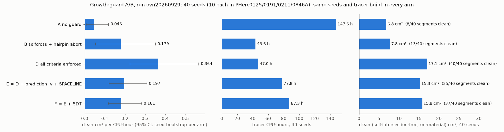
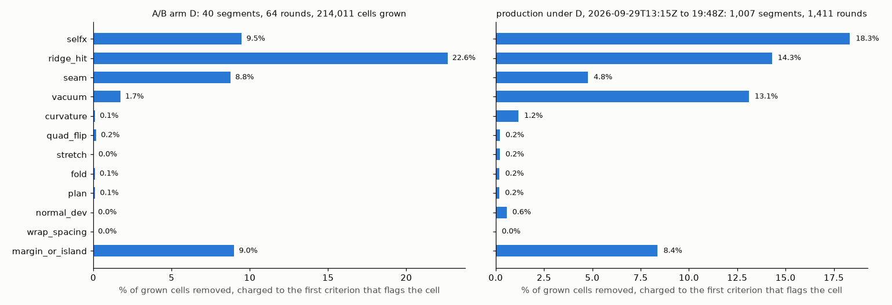
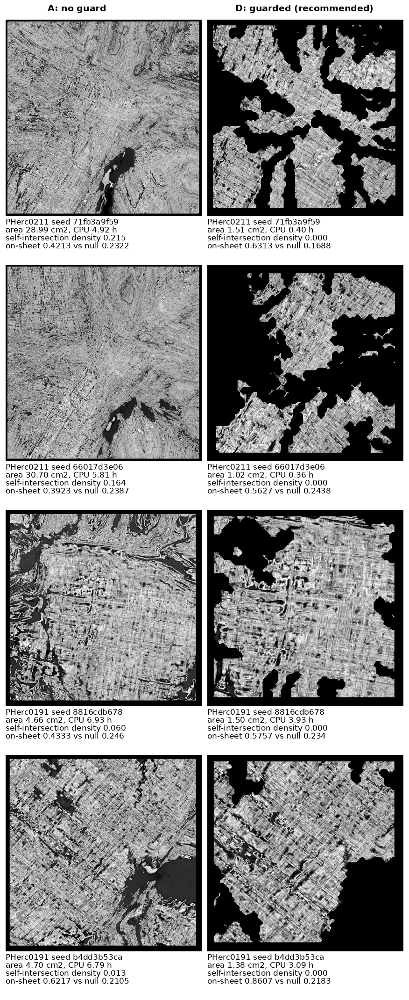
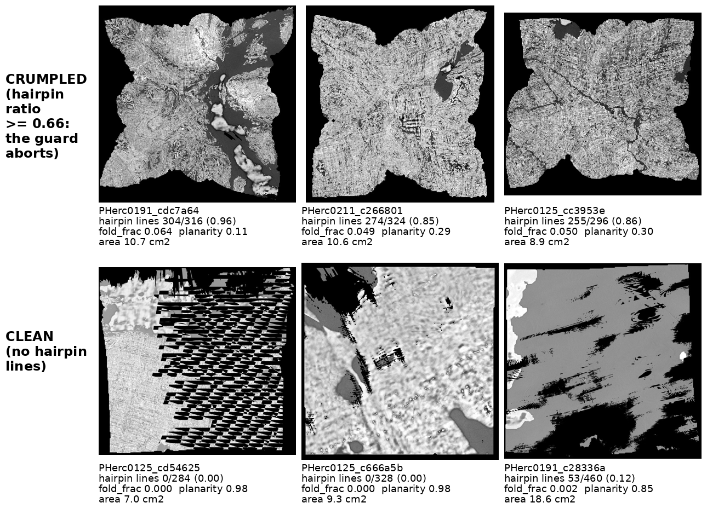

# Guarded growth for VC3D: self-intersection-free segments, fail-fast seeds, and every guard metric

*Progress-prize write-up, September 2026. Code: `tifxyz_tools/growth_guard.py` (the guard),
`tifxyz_tools/guarded_grow.py` (the driver), `presets/` (the policies tested), `ab/` (the data and
the script that recomputes every number below), `tests/` (50 tests). Nothing in VC3D's C++ is changed.*

## What it is

`guarded-grow` runs VC3D's `vc_grow_seg_from_seed` in rounds. After each round it checks the new
surface and trims whatever fails, then resumes from the trimmed checkpoint, the way a person stops a
grow, inspects it, trims it and resumes. It stops a seed when nothing sound is left, when growth keeps
coming back onto trimmed ground, or when a self-intersection survives the trim.

The checks are upstream's own `vc_tifxyz_selfcross` plus twelve per-cell or per-segment criteria.
Each criterion is always **measured** and only **enforced** when the policy says so, so the same
code can be used to watch growth without touching it.

```bash
guarded-grow --volume CT.zarr --normal-grids GRIDS/ --seed X Y Z --out OUT/ \
    --policy presets/D.json --pred SURFACE_PRED.zarr --umbilicus umbilicus.json --vc-bin VC3D/bin
```

## Headline, and how far to trust it

Pre-registered A/B, run `ovn20260929`: 40 seeds (10 each in PHerc0125, PHerc0191, PHerc0211 and
PHerc0846A, all 2027 prize scrolls), each grown **once under every policy** from the same seed with the
same tracer build (md5 `b747f765…`), 30-minute wall ceiling per seed, 10 generations per round.

- A segment's area counts as **clean** only if `vc_tifxyz_selfcross` density is exactly 0 on the
  delivered checkpoint **and** ≥ 75 % of it lies on material.
- CPU is the tracer's, summed over every round, including seeds that failed.



| policy (`presets/`) | self-intersection-free segments | clean cm² | raw cm² | tracer CPU-h | clean cm² / CPU-h | × no guard, paired seed bootstrap 95 % CI |
|---|---|---|---|---|---|---|
| **A** no guard | 8 / 40 | 6.85 | 372.04 | 147.64 | 0.0464 | 1× |
| **B** selfcross + hairpin abort | 13 / 40 | 7.79 | 49.47 | 43.57 | 0.1787 | 3.85× [2.14, 15.06] |
| **D** B + every criterion enforced | **40 / 40** | **17.10** | 17.10 | **46.95** | **0.3642** | **7.85× [3.47, 48.37]** |
| **E** D + surface prediction as `-v` + SPACELINE | 35 / 40 | 15.31 | 30.32 | 77.84 | 0.1967 | 4.24× [1.46, 27.63] |
| **F** E + on-the-fly SURFACE_SDT | 37 / 40 | 15.84 | 15.84 | 87.28 | 0.1815 | 3.91× [1.37, 26.39] |

**Growth savings.** On the same 40 seeds, D produced **2.5× the clean area** of no guard
(17.1 vs 6.85 cm²) for **0.32× the tracer CPU** (46.9 vs 147.6 CPU-h, **100.7 CPU-h saved**).
The guard's own cost was **993 s**, 0.59 % of D's tracer CPU.

Recompute: `python ab/metric.py ab/ovn20260929/rows_reaudited.jsonl`.

**The pre-registered pass rule** was "self-intersection density 0 on every seed, and efficiency no
worse than no guard by more than 10 %". **Only D passes.**

Per scroll (clean cm² / CPU-h, 10 seeds each):

| scroll | A | D |
|---|---|---|
| PHerc0125 | 0.631 | 0.733 |
| PHerc0191 | 0.061 | 0.240 |
| PHerc0211 | 0.000 | 2.122 |
| PHerc0846A | 0.004 | 0.172 |

The pooled gain comes from the three scrolls where unguarded growth almost never yields a clean
segment. Where it already works (PHerc0125), the gain is 1.16×.

Before the guard, a stratified random sample of the fleet's week of growth (n = 383 segments of
16,886, 23 scrolls) was **7.1 %** self-intersection-free [4.7 %, 9.9 %]; 15 of 23 scrolls had none.

## Every guard metric, with its firing rate

A cell cut by several criteria is charged to the first in this order: selfx, overlap, vacuum, fold,
plan, quad_flip, stretch, normal_dev, ridge_hit, seam, wrap_spacing, curvature, empty_space.
"margin_or_island" is surface removed because it was cut off from the kept piece or sat in the safety
margin around a cut.

"Computed" counts rounds where the criterion had its input (a CT, a surface prediction, an
umbilicus, lasagna normals); a criterion without input is skipped, never scored as clean.
"Fires" counts rounds where it flagged at least one cell. "Would stop" is its segment-level verdict.



| criterion | what it measures | input | A/B arm D: rounds computed / fires / would stop (of 64) | A/B D: % of grown cells removed | production under D: rounds computed / fires / would stop (of 1,411) | production: % of cells removed |
|---|---|---|---|---|---|---|
| **selfx** | the quad crosses another quad of the same surface (`vc_tifxyz_selfcross`, new cells + 200-voxel halo); after the trim any crossing left stops the seed | none | 64 / 38 had crossings before the trim / — | 9.5 % | 1,411 / 1,197 (84.8 %) / — | 18.3 % |
| **hairpin abort** | `geo_hairpin_lines / geo_lines_read` ≥ 0.66 (turn radius < 500 µm over 1 mm of lattice line); held-out test TPR 1.00 / FPR 0.29, n = 20 segments | none | abort 0 | — | abort 0 in this window (143 since 2026-09-25) | — |
| **vacuum** | CT ≤ 5 over ≥ 75 % of a 5 × 5-cell window | CT | always | 1.7 % | always | 13.1 % |
| **fold** | turn radius < 300 µm over 1 mm of arc, per cell | none | always | 0.1 % | always | 0.2 % |
| **plan** | cell normal > 70° from its window's mean normal (crumple) | none | always | 0.1 % | always | 0.2 % |
| **quad_flip** | the quad's orientation reverses relative to its neighbours | none | 64 / 41 / — | 0.2 % | 1,411 / 1,285 / — | 0.2 % |
| **stretch** | an edge > 3× the lattice median edge | none | 64 / 10 / — | 0.03 % | 1,411 / 484 / — | 0.2 % |
| **normal_dev** | > 45° from the lasagna normal field | lasagna nx/ny | **0 / 0 / 0 (never computed)** | 0 | 110 / 110 / — | 0.6 % |
| **ridge_hit** | no surface-prediction ridge within ±3 voxels along the normal; segment stops when > 50 % of cells lack one | prediction | 64 / 64 / 13 | **22.6 %** | 1,003 / 1,003 / 207 | 14.3 % |
| **seam** | the nearest ridge jumps ≥ 12 voxels between neighbouring cells (a step onto another sheet) | prediction | 64 / 63 / — | 8.8 % | 1,003 / 1,003 / — | 4.8 % |
| **empty_space** | frontier cells with no prediction support at their own position; stop when > 50 % | prediction | 64 / 64 / 41 | (stop only) | 1,003 / 1,003 / 804 | (stop only) |
| **wrap_spacing** | radial jump inconsistent with a 700 µm winding pitch about the umbilicus | umbilicus | 17 / 2 / — | 0 | 1,411 / 198 / — | 0.01 % |
| **curvature** | turn radius < 0.30 × distance to the umbilicus | umbilicus | 17 / 9 / — | 0.1 % | 1,411 / 1,225 / — | 1.2 % |
| **roughness** (segment) | frontier perimeter / √area > 6 | none | 64 / — / 0 | — | 1,411 / — / 25 | 23 stops |
| **flatten_feedback** (segment) | recent flattens of this segment collapsed | pipeline hook | not computed | — | not computed | — |
| **overlap** | the cell is already held by another segment (same-sheet estimator) | other segments | off in the A/B | — | per-host neighbour index | not separately counted |
| margin_or_island | removed with a cut | — | — | 9.0 % | — | 8.4 % |
| **total removed** | | | | **52.2 %** (214,011 → 102,327 cells) | | **61.4 %** (9,112,527 → 3,515,326 cells) |

**Stops**, per seed or segment:

| where | seeds or segments | nothing_left | frontier_blocked | selfcross_nonzero | roughness | exhausted / wall / other |
|---|---|---|---|---|---|---|
| A/B arm D | 40 | 18, all in round 1 | 17 | 0 | 0 | 5 |
| production under D, 2026-09-29 13:15–19:48 UTC | 1,007 | 405 | 254 | 162 | 23 | 165 not stopped by the guard in this window |

Guard overhead in production: 23,504 s against 937,843 s of tracer CPU = **2.5 %**.

Production windows are 6.5 h on 20 scrolls. Clean yield per CPU-hour **after** the production switch
has **not** been measured yet; it needs the same selfcross audit on a random sample of delivered
segments, as was done for the 7.1 % baseline.

## Illustrations, and what they do and do not show

**Same seed, no guard vs guarded.** Final checkpoints of four A/B seeds, rendered from the CT
(`vc_render_tifxyz -g 0 --scale 0.5`, one surface slice, contrast-stretched 1–99 %). Each image is
scaled to the same box, so **D's images are magnified about 1.6–3.4× relative to A's**: A's surfaces are
3.1–30× larger (areas in the captions).



What an honest reader sees:
- The unguarded surfaces are large and continuous, and they self-intersect (density 0.013–0.215).
  The self-intersections are not visible in a flat render; they are the places where the render
  shows papyrus twice.
- The guarded surfaces are the parts that passed: smaller, ragged, and with many holes where cells
  were trimmed.
- The trimmed-to surface does sit on predicted sheet far more often than it sits half a pitch off it
  (on-sheet 0.56–0.86 vs 0.17–0.24).

**Crumpled vs clean in the source pipeline's own renders** (images served by its segment gallery,
selected by the hairpin metric only):



This figure is included because it **contradicts** a naive reading. The top row has hairpin ratios
0.85–0.96, which the guard aborts, yet the renders show papyrus texture. The bottom row is
geometrically clean (hairpin 0–0.12, planarity 0.85–0.98), yet two of the three renders look smeared
or sit in voids. **Geometric cleanliness is not readability.** The guard removes surfaces that fold
through themselves, which cannot be flattened correctly, but passing it is not evidence that a
surface follows a sheet. The on-sheet check below is the stronger evidence for that.

## A quality read not used by the self-intersection gate

For every A, B and D final checkpoint of the A/B:
- we took up to 3,000 lattice points and measured how often the surface prediction is positive there
  ("on-sheet");
- as a null, we moved the same points ±10 voxels (half the lamina pitch) along the normal.

`ab/ovn20260929/onsheet_ab.json` has the per-segment numbers.

| arm | segments measured | on-sheet p50 | null p50 | lift p10 / p50 / p90 | lift > 0 |
|---|---|---|---|---|---|
| A | 40 | 0.323 | 0.233 | 0.001 / 0.048 / 0.384 | 36 / 40 |
| B | 40 | 0.407 | 0.237 | −0.005 / 0.081 / 0.384 | 32 / 40 |
| D | 22 (18 had < 50 points left) | 0.682 | 0.213 | 0.291 / 0.455 / 0.658 | 22 / 22 |

Paired lift, D − A: **+0.262** [0.212, 0.320], D > A on 22/22 seeds. B − A: **+0.025**
[0.011, 0.044], 23/40.

**This is independent of the self-intersection gate but NOT of D's ridge_hit, seam and
empty_space criteria**, which read the same prediction. D's large lift is therefore partly by
construction. B's small lift, from a policy that never reads the prediction, is the clean
comparison.

## Is ridge_hit over-pruning? (measured 2026-09-29)

`ridge_hit` flags a cell when the thresholded surface prediction has no positive voxel within
±3 voxels of the cell along its normal. It is D's largest pruner, so we measured two things:
- how much it removes from segments already known to be clean;
- whether what it removes elsewhere is sound surface, judged by a test that does not use the
  prediction.

Summary numbers: `ab/ovn20260929/ridge_hit_fpr_2026-09-29.json`.

**1. Removal rate on known-clean segments.** 156 segments whose `vc_tifxyz_selfcross` density is
exactly 0 (114 PHerc0125, 36 PHerc0191, 6 PHerc0211; drawn from 3,000 random segments), 1.46 M cells.
The per-cell mask matched an earlier independent run on all 156 segments, cell for cell. Run on its
own, as production enforces it (frontier-touching regions ≥ 12 cells):

| | pooled, 95 % CI (bootstrap over segments) | per segment p10 / p50 / p90 |
|---|---|---|
| cells flagged | **24.9 %** [22.2, 28.0] | 10.9 / 21.7 / 71.2 % |
| cells removed as enforced | **16.7 %** [13.6, 20.2] | 3.2 / 11.3 / 69.4 % |
| cells removed including islands cut off | 19.0 % [15.4, 23.0] | |

- Removal by scroll: PHerc0125 13.8 %, **PHerc0191 34.0 %**, PHerc0211 8.4 %.
- ridge_hit alone would have emptied 14 of the 156 segments.

Read against "self-intersection-free" as the truth, that is a high false-positive rate. The earlier
segment-level figure (60.9 % of these segments over the 0.2011 threshold) is the same observation.
**But self-intersection-free is not the same as on-sheet**, so we asked whether those cells lie on
papyrus at all.

**2. An independent on-sheet test: the CT itself.** For each cell:
- sample the CT at level 0 along the cell's normal, ±12 voxels;
- score = the brightest value within ±3 voxels minus the median of the profile;
- compare that score with the same score half a lamina pitch away (±10 voxels) on the same normal.

A cell on a sheet sits on a density peak, so it scores higher at 0 than beside it, whatever the local
contrast. This uses no prediction and no geometry criterion. But the prediction is itself a model of
this CT, so the two are not fully independent; they can fail together where contrast is low.

| | cells ridge_hit supports | cells ridge_hit removes |
|---|---|---|
| clean 156 segments: CT lift at the cell over beside it (grey levels, mean over segments, 95 % CI) | **+13.1** [9.7, 16.8] | **−3.9** [−4.8, −3.2] |
| clean 156: cells brighter than both neighbours at ±10 voxels | 43.9 % | 26.8 % |
| production sample (40 rounds): CT lift | **+11.4** [5.6, 18.4] | **−1.6** [−2.7, −0.4] |
| production sample: brighter than both neighbours | 35.1 % | 23.9 % |

The cells ridge_hit removes show **no CT sheet peak**: their lift is below zero, and below the
level of the cells it keeps. On the clean segments, a mixture estimate puts the "on-sheet-like"
share of removed cells at **4 %** [−5, 15]. It works by placing removed cells between the kept
cells and the half-pitch null on a pass-rate scale.

**3. Production's cut.** Under D, from 2026-09-29 13:15 to 19:48 UTC (1,411 rounds):
- 5,597,201 cells were removed, 61.4 % of those grown;
- ridge_hit was charged with 1,302,818 of them: **23.3 % of what was removed, 14.3 % of what was
  grown**.

Sample: 40 rounds drawn at random from the 563 with ridge pruning on scrolls whose full CT and
prediction are local (PHerc0826 20, PHerc0191 14, PHerc0125 3, PHerc0813 3). For each, we pulled
the pre-guard and the guarded checkpoint from the host that grew it.
- Recomputing the guard reproduced the production cut: 213,515 of 213,627 removed cells, and the
  ridge_hit attribution to within 1.6 % (87,489 vs 86,109 cells; 32 of 40 rounds exact).
- The estimated share of ridge-removed cells that were sound is **−14 % [−48, 25]** on the pass-rate
  estimator and **33 % [6, 96]** on the mean-score estimator. Both are wide. Neither is evidence of
  large-scale removal of sound surface. The upper bounds allow up to about a quarter to a third.
- At the mean-score point estimate, sound surface removed by ridge_hit would be about 0.33 × 14.3 %
  ≈ **4.7 % of grown cells** (CI 0.9 %–13.7 %).

**Verdict, stated plainly.**
- ridge_hit removes a lot, including ~17 % of the cells of segments that never self-intersect, and
  34 % on PHerc0191.
- By the only independent check available, the removed cells do not look like sheet surface.
  So this is **not measured over-pruning**, but it is **not proven safe** either.
- The CT test's own separation is modest: AUC 0.642 for kept cells vs the half-pitch null. The
  production estimate spans roughly 0 to a third.
- If the goal is to cap the risk:
  - relaxing `ridge_hit_vox` from 3 to 5 voxels, or scoring only the frontier (as `empty_space`
    does), would cut less;
  - neither has been measured.
- The decision to relax it is the operator's.

**Human review.** `ridge_review/` (README there) is a blind, stratified sample of 160 real ridge_hit decisions. It covers 6 scrolls and 3 severity strata, with production prevalence, a static review page, and a scorer that reweights human labels to the production cut. Until someone reviews it, the verdict above rests on the automated CT test alone.

## Integration with upstream tools, and what was compared

| upstream tool or parameter | how the guard relates | measured here? |
|---|---|---|
| `vc_grow_seg_from_seed` / GrowPatch (Ceres) | Driven unchanged, round by round with `--resume`. Every `--params` key passes through; a preset may add tracer params (E, F). | yes: every arm, same build |
| **SPACELINE** (`space_line_weight`, reads `-v`) | Arm E arms it from round 1 with the surface prediction as `-v`. It keeps the tracer on material: vacuum trimming fell from 3,714 to 216 cells vs D. But it cost 66 % more CPU and ranked below D (4.24× vs 7.85×). Earlier single-scroll work measured material 26 % → 96 % with it. It is a complement to the guard, not a substitute. | yes (arm E) |
| **SURFACE_SDT** (`sdt_weight`, `cell_reopt_mode`) | Arm F adds it on top of E; the signed distance is computed on the fly from `-v`, so no separate SDT volume is needed. 3.91×, and 6 seeds stopped on roughness. `sdt_weight` 5.0 is a first guess; upstream's default is 0 and nothing was swept. | yes (arm F), unswept |
| **REFERENCE_RAY** (`reference_ray_weight` + `reference_surface`) | Arm G uses a converged Route B spiral-fit winding as the reference mesh, so the local tracer is steered by the global fit. 20/20 seeds clean; 3.86 (PHerc0125) and 2.58 (PHerc0211) clean cm²/CPU-h. It was a **separate, unpaired draw** inside the reference mesh's box, so there is no ratio to A. It is the most promising combination and the least tested. | exploratory only |
| `patch_normal_*` (FixedPatchNormalAlignment) | Would pull the growing quad onto the normals of existing patches, disambiguated by an umbilicus. A natural partner of the guard's overlap criterion. | no |
| `vc_tifxyz_selfcross` | Upstream's census, report-only there. The guard makes it an enforced trim-and-verify loop, with incremental checks on new cells + a halo. A binary that cannot run raises `GuardBroken`, never a silent pass. | yes |
| `vc_grow_seg_from_segments --sweep` and its 8 metrics | Upstream already scores a grown surface. `sweep_valid_bbox_fill_fraction`, `sweep_enclosed_hole_fraction` and `sweep_mesh_completeness_score` need no target and could be three more segment-level criteria. The other five compare against a target surface: a tuning tool, not an in-loop guard. The two are complementary: the sweep chooses parameters, the guard polices a run. | **not computed on A/B outputs** |
| `vc_calc_surface_metrics` | The only upstream surface-quality ground truth (`in_surface_frac_valid`, `winding_valid_fraction`). It needs point-collection annotations that do not exist for these scrolls. It is the independent validation this work most lacks. | no (needs annotation) |
| Route B, `spiral-fitting/fit_spiral.py` | Supplies arm G's reference mesh and the umbilicus used by `wrap_spacing` and `curvature`. The guard's per-cell criteria can grade a Route B winding exported as tifxyz. `vc_tifxyz_selfcross` is nearly vacuous on a single winding; use the spiral-fit checks for those. | partly (arm G) |
| lasagna | `normal_dev` reads lasagna's nx/ny normal field where it is published (110 production rounds; never in the A/B). As an alternative optimiser, lasagna has no round loop to guard, but its `fit2tifxyz` output can be graded by the same criteria. | no |
| Copy Out/In, neural tracer | A copied or neurally traced patch is a tifxyz and can be passed through `guard_tifxyz` before it is trusted. | no |
| Issue #1641 (seam-darkening sheet-switch detector) | Complementary: it sees whole-winding jumps that do not self-intersect, which no criterion here claims to see. It could become another criterion where voxel < winding spacing / 40. | no |

## Limitations, stated plainly

1. **Guarded arms stop on self-intersection**, so "40/40 clean" for D is partly by construction. The
   A/B measures how much clean area survives per CPU-hour. It does not show that the guard produces
   better surfaces by some independent standard: the on-sheet lift above is the closest, and it is
   partly circular for D.
2. **Small, ragged patches.** D's median clean area per seed is **0.10 cm²** (max 3.18 cm²; 7 of 40 ≥
   1 cm²). **18 of 40 D seeds were trimmed to nothing in round 1.** First Letters needs a 4 cm²
   region. The gain is mainly from stopping bad seeds early, not from growing large sheets.
3. **ridge_hit is D's largest pruner** (22.6 % of cells in the A/B, 14.3 % in production). Its
   false-positive rate is measured in the next section. The finding: on clean segments it removes
   16.7 % of cells. By an independent CT test those cells look like surface lying off the sheet, not
   sound surface wrongly cut. The CT test is weak, so this is evidence, not proof.
4. **CPU savings depend on the 30-minute ceiling.** 20 of 40 unguarded seeds ran until the wall
   ceiling. A longer ceiling raises A's CPU and the ratio; a shorter one lowers it.
5. **No "grow unguarded, trim afterwards" control.** That is the natural alternative and it was not
   run.
6. **One seed draw, four scrolls, one tracer build.** Each scroll ran on one host, so host speed
   cancels within a scroll but not across the pooled ratio. The upper CI bound (48×) reflects how few
   clean unguarded segments there are.
7. **Two unguarded rows have no self-intersection reading.** The audit binary failed to load there
   (glibc). They count as not clean; both had hairpin ratios 0.97–0.99.
8. One arm-F row (`cbc0f94de0`: 11.1 CPU-s for 1.17 cm²) is unexplained. It is kept, and it inflates
   F's PHerc0211 cell only.
9. **Not every criterion acted in the A/B.** `normal_dev` never had its input, `wrap_spacing` and
   `curvature` only in 17 of 64 D rounds, `flatten_feedback` never, and `overlap` was off. "All
   criteria enforced" means all that could be computed.
10. **Geometric cleanliness is not readability** (see the second figure). No ink or human-review
    comparison of A vs D exists yet.
11. The tracer is reproducible only at `thread_limit` 1; the guard is deterministic given a
    checkpoint.

## Validation of the code on this branch

- `pytest tests` → 50 tests. The 6 real-binary selfcross tests skip without `vc_tifxyz_selfcross`
  and pass with it (`SELFCROSS_BIN=…`).
- Every test class was made to fail by a deliberate mutation. The driver's own mutations:
  - newest checkpoint by name instead of time → red;
  - `nothing_left` reporting the pre-trim area → red;
  - vacuum criterion off → red.
- End-to-end run with the real VC3D binaries (different build from the A/B: md5 `06f68444…`) on
  A/B seed `8972dac333` (PHerc0211):
  - A: 2 rounds, 0.483 cm², 22.5 tracer CPU-s.
  - D: 2 rounds, 0.125 cm², 8.6 tracer CPU-s + 1.0 guard-s; selfcross ran before and after each
    trim, density 0.
  - Both runs stopped on the exhausted rule.
  - This is a functional check of the driver, not a re-measurement.

*AI-assisted (Claude), human-directed.*
